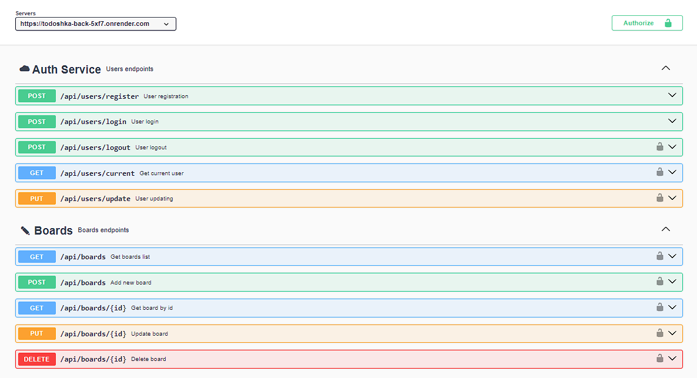

**Read in another language: [Ukrainian](README.ua.md).**

# Backend API "TaskPro"

This repository contains the TaskPro Backend API project, which provides an API for interacting with the TaskPro application

<a href="https://todoshka-project.vercel.app/">This is a link to the frontend deploy</a>

<a href="https://github.com/rango198/todoshkaProject">This is a link to the frontend repository</a>

## Table of contents

- [Project overview](#project-overview)
- [Technologies used](#technologies-used)
- [Our team](#our-team)
- [API Documentation](#api-documentation)
- [Requirements](#requirements)
- [Instalattion](#instalattion)
- [Configuration](#configuration)
- [Server Commands](#server-commands)

## Project Overview

This project implements the server-side component of the TaskPro application. It is built on Node.js, utilizing the Express.js framework to implement the API and Mongoose for interacting with the MongoDB database.

## Technologies Used

Here are some of the key technologies used in this project:

- Node.js: JavaScript runtime environment for server-side execution.
- Express.js: Framework for building server applications and APIs.
- MongoDB: NoSQL database for data storage.
- Mongoose: Library for interacting with MongoDB.
- Axios: Library for making HTTP requests.
- JWT: Standard for authentication and authorization.
- Bcrypt: Library for hashing passwords.
- Cloudinary: Service for storing and processing media files.
- Joi: Library for data validation.
- Nodemailer: Module for sending emails.
- Swagger UI: Tool for documenting and testing APIs.
- Multer: Middleware for file uploads.
- Multer Storage Cloudinary: Storage integration for Multer with Cloudinary.
- Nanoid: Library for generating unique identifiers.
- Query String: Library for working with URL parameters.
- CORS: Manages resource access from different origins.
- Cross-env: Utility for setting environment variables.
- Dotenv: Library for managing environment variables.

## Our team

1. **Serhii Safonov** - `team-lead`,`developer`
   <a href="https://github.com/KaratSergio">github profile</a>
2. **Mariia Samodurova** - `scrum-master`,`developer`
   <a href="https://github.com/MariiaSam">github profile</a>
3. **Serhii Busha** - `developer` <a href="https://github.com/rango198">github
   profile</a>
4. **Inha Sydorchuk** - `developer` <a href="https://github.com/inhasid">github
   profile</a>
5. **Anastasiia Rodzina** - `developer`
   <a href="https://github.com/Anastasiia-Rodzina">github profile</a>
6. **Oleksandra Koshyl** - `developer`
   <a href="https://github.com/sashasashkina">github profile</a>
7. **Natalia Potushynska** - `developer`
   <a href="https://github.com/NataliaPot">github profile</a>
8. **Anna Voitsekhovska** - `developer`
   <a href="https://github.com/Anna4voit">github profile</a>
9. **Tetiana Kubrak** - `developer`
   <a href="https://github.com/TetianaKubrak73">github profile</a>

## API Documentation

For detailed descriptions of API requests and interactions, refer to the <a href="https://todoshka-back-5xf7.onrender.com/api-docs/">TaskPro documentation</a>

## Requirements

Before getting started with the project, make sure you have the following tools installed on your computer:

- Node.js (version 18 or higher)

## Installation

1. Clone this repository to your local computer.
2. Open the terminal and navigate to the root folder of the project.
3. Run the command `npm install`.

## Configuration

1. Create a .env file in the project's root folder, based on the .env.example file.
2. Specify the necessary environment variables in this file.

## Server Commands

**npm:**

- `npm start` — Start the server in production mode.
- `npm run dev` — Start the server in development mode.
