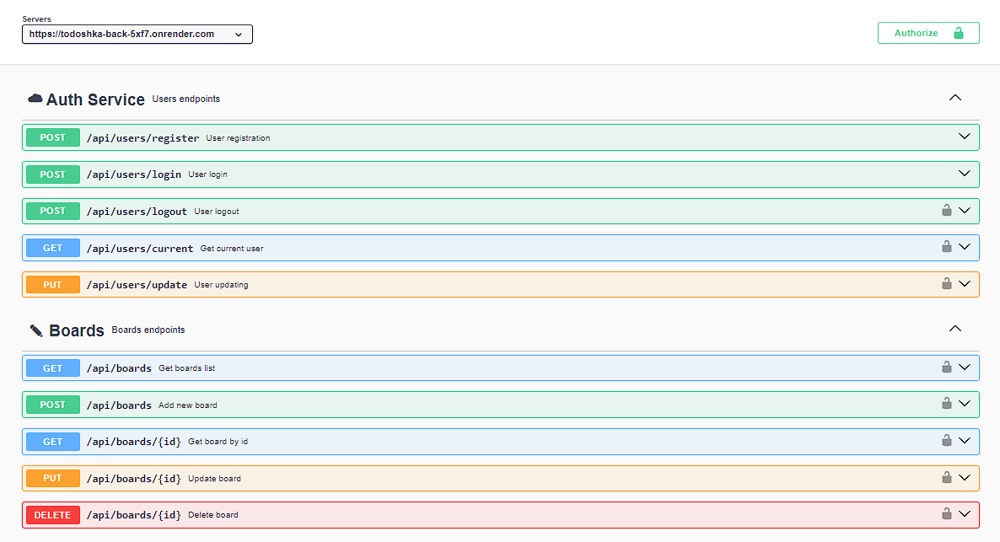
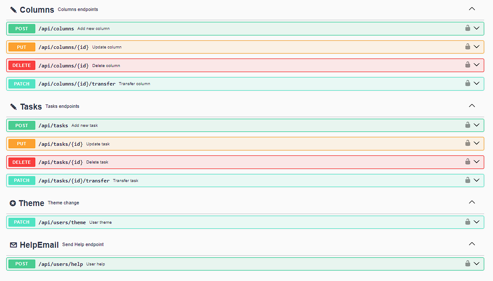

**Читати іншою мовою: [Англійська](README.md).**

# Бекенд API "TaskPro"

У цьому репозиторії міститься проект бекенду API TaskPro, який надає API для взаємодії з додатком TaskPro.

<a href="https://todoshka-project.vercel.app/">Посилання на
розгорнутий фронтенд</a>

<a href="https://github.com/rango198/todoshkaProject">Посилання на репозиторій фронтенду</a>

## Зміст

- [Огляд проекту](#огляд-проекту)
- [Використані технології](#використані-технології)
- [Наша команда](#наша-команда)
- [Документація API](#документація-api)
- [Вимоги](#вимоги)
- [Інсталяція](#інсталяція)
- [Конфігурація](#конфігурація)
- [Команди сервера](#команди-сервера)

## Огляд проекту

Цей проект реалізує серверну частину додатку TaskPro. Він побудований на Node.js, використовуючи фреймворк Express.js для реалізації API та Mongoose для взаємодії з базою даних MongoDB.

## Використані технології

Ось кілька ключових технологій, які використовуються у цьому проекті:

- Node.js: Середовище виконання JavaScript на сервері.
- Express.js: Фреймворк для створення серверних додатків та API.
- MongoDB: NoSQL база даних для зберігання даних.
- Mongoose: Бібліотека для взаємодії з MongoDB.
- Axios: Бібліотека для виконання HTTP-запитів.
- JWT: Стандарт для автентифікації та авторизації.
- Bcrypt: Бібліотека для хешування паролів.
- Cloudinary: Сервіс для зберігання та обробки медіафайлів.
- Joi: Бібліотека для валідації даних.
- Nodemailer: Модуль для надсилання електронної пошти.
- Swagger UI: Інструмент для документування та тестування API.
- Multer: Middleware для завантаження файлів.
- Multer Storage Cloudinary: Сховище для Multer, інтегроване з Cloudinary.
- Nanoid: Бібліотека для генерації унікальних ідентифікаторів.
- Query String: Бібліотека для роботи з параметрами URL.
- CORS: Управління доступом до ресурсів з різних джерел.
- Cross-env: Утиліта для встановлення змінних середовища.
- Dotenv: Бібліотека для роботи з змінними середовища.

## Наша команда

1. **Сафонов Сергій** - `team-lead`,`розробник`
   <a href="https://github.com/KaratSergio">github профіль</a>
2. **Марія Самодурова** - `scrum-master`,`розробник`
   <a href="https://github.com/MariiaSam">github профіль</a>
3. **Сергій Буша** - `розробник` <a href="https://github.com/rango198">github
   профіль</a>
4. **Інга Сидорчук** - `розробник` <a href="https://github.com/inhasid">github
   профіль</a>
5. **Анастасія Родзіна** - `розробник`
   <a href="https://github.com/Anastasiia-Rodzina">github профіль</a>
6. **Олександра Кошиль** - `розробник`
   <a href="https://github.com/sashasashkina">github профіль</a>
7. **Наталія Потушинська** - `розробник`
   <a href="https://github.com/NataliaPot">github профіль</a>
8. **Анна Войтцеховська** - `розробник`
   <a href="https://github.com/Anna4voit">github профіль</a>
9. **Тетяна Кубрак** - `розробник`
   <a href="https://github.com/TetianaKubrak73">github профіль</a>

## Документація API

Для детальних описів запитів та взаємодій з API перегляньте <a href="https://todoshka-back-5xf7.onrender.com/api-docs/">документацію TaskPro</a>

## Вимоги

Перед початком роботи з проектом переконайтеся, що у вас встановлені наступні інструменти на вашому комп'ютері:

- Node.js (версія 18 або вище)

## Інсталяція

1. Склонуйте цей репозиторій на свій локальний комп'ютер.
2. Відкрийте термінал і перейдіть до кореневої теки проекту.
3. Запустіть команду `npm install`.

## Конфігурація

1. Створіть файл .env у кореневій теці проекту, виходячи з файлу .env.example.
2. Вкажіть необхідні змінні середовища в цьому файлі.

## Команди сервера

**npm:**

- `npm start` — Запустити сервер у режимі продакшену.
- `npm run dev` — Запустити сервер у режимі розробки.
